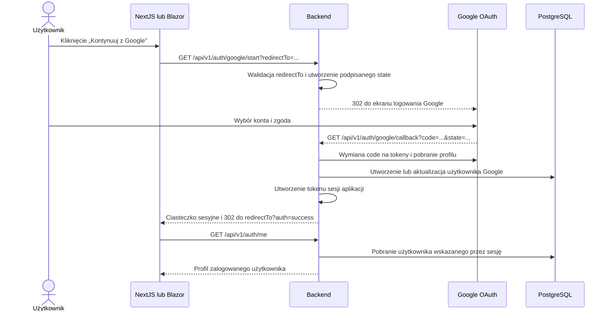
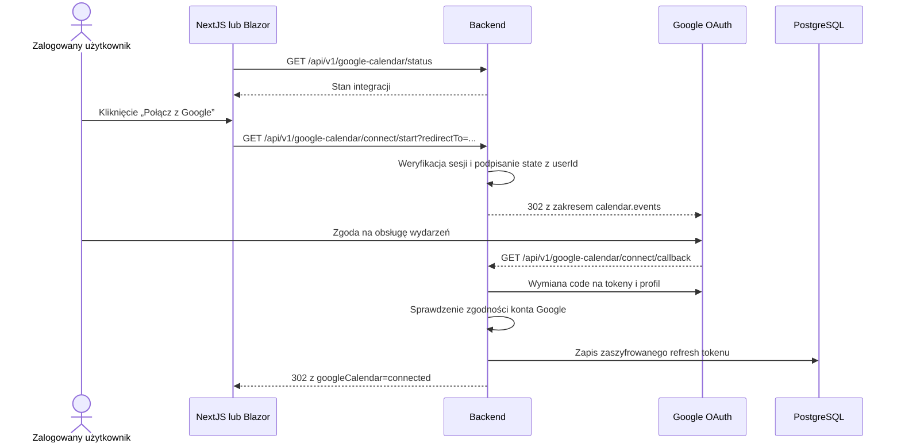

# Logowanie i synchronizacja z Google Calendar

Dokument opisuje pełny przebieg od kliknięcia przycisku logowania, przez utworzenie sesji aplikacji i połączenie Google Calendar, aż do utworzenia lub usunięcia wydarzenia podczas obsługi rezerwacji.

NextJS i Blazor korzystają z tego samego backendu oraz tego samego mechanizmu Google OAuth. Frontendy nie uwierzytelniają użytkownika samodzielnie i nie obsługują logowania hasłem.

## 1. Logowanie kontem Google

### Frontend

W NextJS przycisk na stronie `/login` wywołuje `loginWithGoogle` z `AuthProvider`. W Blazorze przycisk wywołuje `LoginWithGoogleAsync` z `AuthContext`. Oba frontendy budują adres backendu `/auth/google/start`, przekazują własny adres `/login` jako `redirectTo` i wykonują pełne przekierowanie przeglądarki.

Pełne przeładowanie dokumentu jest wymagane, ponieważ użytkownik opuszcza frontend, przechodzi przez backend i stronę Google, a następnie wraca do aplikacji.

### Backend i Google OAuth

Backend:

1. Sprawdza, czy origin parametru `redirectTo` odpowiada skonfigurowanemu adresowi NextJS albo Blazora.
2. Umieszcza docelowy adres w podpisanym, ograniczonym czasowo parametrze OAuth `state`.
3. Przekierowuje użytkownika do Google z zakresami `openid`, `email` i `profile`.
4. W callbacku weryfikuje `state`, wymienia kod autoryzacyjny i pobiera profil Google.
5. Normalizuje identyfikator Google, e-mail, nazwę, avatar i status weryfikacji e-maila.
6. Tworzy użytkownika w bazie albo aktualizuje istniejący rekord wyszukany po `googleId` lub adresie e-mail. Nowe konto otrzymuje rolę `user`.
7. Tworzy token sesji aplikacji i zapisuje go w ciasteczku `HttpOnly`, `SameSite=Lax`; w środowisku produkcyjnym ciasteczko ma również flagę `Secure`.
8. Przekierowuje użytkownika do wybranego frontendu z parametrem `auth=success`.

Token Google nie jest sesją frontendu. Po zakończeniu OAuth backend wystawia własną sesję aplikacji. Kolejne wywołania API przesyłają ciasteczko przez `credentials: include` w NextJS albo browser credentials w Blazorze.

### Odtworzenie sesji

Po uruchomieniu frontendu `AuthProvider` w NextJS albo `AuthContext` w Blazorze wywołuje chroniony endpoint `GET /api/v1/auth/me`. Middleware backendu:

1. Odczytuje token z ciasteczka lub nagłówka `Authorization`.
2. Sprawdza podpis, issuer, audience i termin ważności tokenu.
3. Pobiera aktualny rekord użytkownika z bazy.
4. Udostępnia profil frontendowi.

Jeżeli sesja jest poprawna, warstwa routingu przenosi użytkownika z `/login` do strony głównej. Brak lub nieważna sesja powoduje przejście na `/login`.

## 2. Połączenie Google Calendar

Logowanie i dostęp do kalendarza są celowo oddzielnymi zgodami OAuth. Zalogowanie nie daje aplikacji uprawnienia do modyfikowania wydarzeń.

Komponent integracji na stronie rezerwacji najpierw pobiera status przez `GET /api/v1/google-calendar/status`. Endpoint jest chroniony sesją aplikacji.

Po kliknięciu przycisku połączenia frontend przechodzi do `/google-calendar/connect/start`. Backend zapisuje w osobnym `state` identyfikator zalogowanego użytkownika, bezpieczny adres powrotu oraz oznaczenie, że stan dotyczy połączenia kalendarza. Google otrzymuje zakres `calendar.events` razem z podstawowymi zakresami profilu.

W callbacku backend:

1. Weryfikuje podpis i przeznaczenie `state`.
2. Wymienia kod na tokeny Google i profil użytkownika.
3. Wymaga, aby `googleId` konta kalendarza był identyczny z kontem użytym do logowania.
4. Wymaga obecności `refresh_token`, potrzebnego do późniejszych operacji bez udziału użytkownika.
5. Szyfruje refresh token algorytmem skonfigurowanym dla aplikacji, domyślnie AES-256-GCM.
6. Tworzy lub aktualizuje rekord `CalendarIntegration` powiązany z użytkownikiem.
7. Wraca do frontendu z `googleCalendar=connected` albo `googleCalendar=error&reason=...`.

Refresh token pozostaje wyłącznie w backendzie. Frontend otrzymuje tylko status integracji, adres e-mail kalendarza i daty związane z połączeniem.

## 3. Synchronizacja rezerwacji

Synchronizacja następuje podczas operacji na rezerwacji, a nie cyklicznie i nie przez osobny proces w tle.

### Utworzenie rezerwacji

1. Frontend wysyła `POST /api/v1/reservations`.
2. Backend sprawdza salę, zakres czasu i konflikt z innymi rezerwacjami.
3. Backend najpierw zapisuje rezerwację w PostgreSQL.
4. Jeżeli użytkownik ma `CalendarIntegration`, backend odszyfrowuje refresh token i tworzy klienta Google Calendar API.
5. Backend dodaje wydarzenie do kalendarza `primary`. Tytuł, opis, sala, lokalizacja oraz czas pochodzą z zapisanej rezerwacji.
6. Identyfikator wydarzenia Google zostaje zapisany w `Reservation.googleCalendarEventId`.

Synchronizacja Google jest operacją dodatkową. Błąd Google Calendar nie wycofuje poprawnie utworzonej rezerwacji — backend zapisuje błąd w logu i zwraca rezerwację bez identyfikatora wydarzenia.

Połączenie kalendarza nie synchronizuje automatycznie rezerwacji utworzonych wcześniej. Synchronizowane są nowe rezerwacje tworzone, gdy integracja już istnieje.

### Anulowanie rezerwacji

1. Frontend wysyła `PATCH /api/v1/reservations/{id}/cancel`.
2. Backend sprawdza właściciela i bieżący status rezerwacji.
3. Jeżeli rezerwacja ma `googleCalendarEventId` i aktywną integrację, backend próbuje usunąć wydarzenie z kalendarza `primary`.
4. Rezerwacja otrzymuje status `CANCELLED` niezależnie od wyniku dodatkowej operacji Google.
5. Pole `googleCalendarEventId` jest czyszczone tylko wtedy, gdy usunięcie wydarzenia zakończyło się powodzeniem.

### Rozłączenie kalendarza

`DELETE /api/v1/google-calendar/connection` usuwa rekord integracji i zapisany refresh token. Nie usuwa wcześniej utworzonych wydarzeń z Google Calendar i nie zmienia istniejących rezerwacji.

## 4. Podział odpowiedzialności

| Element | Odpowiedzialność |
| --- | --- |
| NextJS / Blazor | Wyświetlenie stanu, rozpoczęcie przekierowania OAuth i wywołanie endpointów API |
| Backend | Walidacja OAuth, sesja, użytkownicy, uprawnienia, szyfrowanie tokenów i synchronizacja rezerwacji |
| Google OAuth | Potwierdzenie tożsamości i wydanie zgód |
| Google Calendar API | Tworzenie i usuwanie wydarzeń |
| PostgreSQL | Użytkownicy, role, integracja kalendarza i rezerwacje |

Frontend nie przechowuje tokenów Google i nie wykonuje bezpośrednich wywołań do Google Calendar API. Cała logika integracji znajduje się w backendzie, dzięki czemu NextJS i Blazor korzystają z identycznych reguł.
